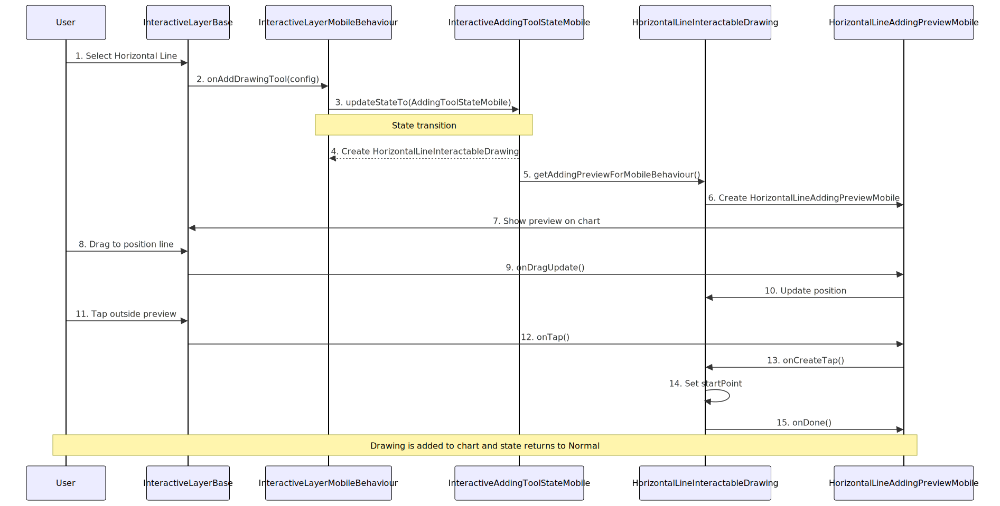

# Interactive Layer

The Interactive Layer is a crucial component of the Deriv Chart that handles user interactions with drawing tools. It manages the lifecycle of drawing tools, from creation to manipulation, and provides a state-based architecture to handle different interaction modes.

## Overview

The Interactive Layer sits on top of the chart canvas and captures user gestures such as taps, drags, and hovers. It then interprets these gestures based on the current state and translates them into actions on drawing tools.

The layer works with several key concepts:
1. **InteractiveState**: Different subclasses/implementations will define a state that interactive layer can be. (adding a tool, a tool being selected, etc) 
2. **InteractiveLayerBehaviour**: Defines platform-specific interaction handling and customizes state transitions
3. **DrawingV2**: The base interface for all drawable elements on the chart
4. **InteractiveLayerBase**: The base class that defines the UI interface for the interactive layer, captures user gestures, and visually renders the layer state on the chart. In the package, it's implemented by a widget stacked on top of the chart.
5. **InteractableDrawing**: Concrete implementations of drawing tools that can be interacted with
6. **DrawingAddingPreview**: Specialized components for handling the drawing creation process

## Interactive States

The Interactive Layer implements a state pattern to manage different interaction modes. Each state handles user interactions differently:

### InteractiveNormalState

This is the default state when no drawing tools are selected or being added. In this state:
- The user can tap on existing drawing tools to select them
- The user can initiate adding a new drawing tool
- All drawing tools are in the `DrawingToolState.normal` state
- Includes hover functionality through the `InteractiveHoverState` mixin

### InteractiveSelectedToolState

This state is active when a drawing tool is selected. In this state:
- The selected tool is in the `DrawingToolState.selected` state
- The user can drag the selected tool to move it
- The user can modify specific points of the selected tool
- Tapping outside the selected tool returns to the `InteractiveNormalState`
- Includes hover functionality through the `InteractiveHoverState` mixin

### InteractiveAddingToolState

This state is active when a new drawing tool is being added to the chart. In this state:
- The new tool is in the `DrawingToolState.adding` state
- The user can tap on the chart to define points for the new tool (e.g., start and end points for a line)
- Once the tool creation is complete, the state transitions back to `InteractiveNormalState`

### InteractiveHoverState

This is implemented as a mixin rather than a standalone state, allowing it to be combined with other states:
- Provides hover detection functionality to any state that includes it
- Changes a drawing tool's state to `DrawingToolState.hovered` when the pointer hovers over it
- Reverts the tool's state when the pointer moves away
- Currently used by both `InteractiveNormalState` and `InteractiveSelectedToolState`

This mixin-based approach allows hover functionality to be reused across different states without code duplication, following the composition over inheritance principle.

## InteractiveLayerBehaviour

The `InteractiveLayerBehaviour` is an abstract class that defines how user interactions are processed and how state transitions occur within the Interactive Layer. It serves as a bridge between raw user input events and the state-based architecture of the Interactive Layer.

Key responsibilities of `InteractiveLayerBehaviour`:

- Processing platform-specific user interactions (mouse events on desktop, touch events on mobile)
- Managing transitions between different `InteractiveState` instances
- Providing appropriate drawing tool previews based on the platform
- Coordinating with `DrawingAddingPreview` to handle the drawing creation process

### Customizing State Transitions

One of the most important aspects of `InteractiveLayerBehaviour` is its ability to customize how transitions between different `InteractiveState` instances occur. This allows for:

- Platform-specific transition logic (e.g., different gesture recognition on mobile vs. desktop)
- Conditional transitions based on the current context or user preferences
- Custom animation or feedback during state changes
- Different interaction patterns for different types of users or use cases

While each `InteractiveState` implementation has its own default behavior for transitioning to other states, the `InteractiveLayerBehaviour` can override these defaults and use entirely different `InteractiveState` implementations. This creates a powerful customization mechanism where the entire interaction flow can be tailored to specific requirements without modifying the core state classes.

For example, on desktop platforms, a transition from `InteractiveNormalState` to `InteractiveSelectedToolState` might occur on a single click, while on mobile platforms it might require a longer press to avoid accidental selections. Similarly, a custom implementation might use specialized state classes optimized for particular use cases or user preferences.

Another example is `InteractiveAddingToolStateMobile`, which provides different behavior when adding a tool with `InteractiveLayerMobileBehaviour`. This specialized state implementation works specifically with the mobile behavior to provide touch-optimized drawing tool creation.

### Platform-Specific Implementations

The Interactive Layer provides different implementations of `InteractiveLayerBehaviour` for different platforms:

- **InteractiveLayerDesktopBehaviour**: Optimized for mouse and keyboard interactions, supporting hover events, precise clicking, and keyboard shortcuts
- **InteractiveLayerMobileBehaviour**: Optimized for touch interactions, with larger touch targets, gesture recognition, and multi-touch support

This separation allows the Interactive Layer to provide a consistent conceptual model across platforms while adapting the specific interaction patterns to match platform conventions and capabilities.

Beyond platform-specific implementations, custom `InteractiveLayerBehaviour` implementations can be created to support:

- Specialized input devices (e.g., stylus, touchpad)
- Accessibility features for users with different needs
- Testing or automation scenarios
- Domain-specific interaction patterns for particular types of charts or analyses

## DrawingV2

`DrawingV2` is the base interface for all drawable elements on the chart. It defines the core functionality that any drawing must implement to be rendered and managed by the Interactive Layer:

1. **Painting**: Renders the drawing on the canvas with appropriate visual styles based on its current state, including colors, line styles, and interactive elements like control points when needed.

2. **Hit Testing**: Determines if a user's interaction point intersects with the drawing, using geometry-specific algorithms that can distinguish between different parts of the drawing (edges, control points, etc.).

3. **Bounds Calculation**: Provides the drawing's bounding rectangle and other key points, ensuring accurate layout and efficient rendering even as the drawing is modified.

4. **Handle User Interaction Gestures**: Processes user inputs (taps, drags, hovers) and responds with appropriate state changes and visual feedback based on the current context.

### DrawingToolState

Each drawing tool that implements `DrawingV2` has its own state, represented by the `DrawingToolState` enum:

```dart
enum DrawingToolState {
  /// Default state when the drawing tool is displayed on the chart
  /// but not being interacted with.
  normal,

  /// The drawing tool is currently selected by the user. Selected tools
  /// typically show additional visual cues like handles or a glowy effect
  /// to indicate they can be manipulated.
  selected,

  /// The user's pointer is hovering over the drawing tool but hasn't
  /// selected it yet. This state can be used to provide visual feedback
  /// before selection.
  hovered,

  /// The drawing tool is in the process of being created/added to the chart.
  /// In this state, the tool captures user inputs (like taps) to define
  /// its shape and position.
  adding,

  /// The drawing tool is being actively moved or resized by the user.
  /// This state is active during drag operations when the user is
  /// modifying the tool's position.
  dragging,
  
  /// The drawing tool is being animated.
  /// This state can be active, for example, when we're in the animation effect
  /// of selecting or deselecting the drawing tool and the selection animation
  /// is playing.
  animating,
}
```

The state of a drawing tool affects how it's rendered on the chart and how it responds to user interactions. All implementations of `DrawingV2` must manage their state and respond appropriately to state changes as part of their responsibility to handle user interaction gestures.

## InteractiveLayerBase

The `InteractiveLayerBase` is an abstract class that defines the interface for the UI component of the Interactive Layer. It serves as the visual representation of the Interactive Layer that is shown to the user and is responsible for:

1. Capturing user gestures (taps, drags, hovers) directly from the chart's UI
2. Visually rendering the current state of the Interactive Layer on the chart
3. Managing the collection of drawing tools and their visual representation
4. Coordinating between user input and the appropriate `InteractiveLayerBehaviour`
5. Displaying visual feedback based on the current `InteractiveState`

In the package implementation, `InteractiveLayerBase` is implemented by a Flutter widget that is stacked on top of the chart's widget stack. This positioning allows it to:

- Intercept all user gestures before they reach the underlying chart
- Render drawings and interactive elements above the chart's data visualization
- Provide a transparent overlay that doesn't interfere with chart visibility

The `InteractiveLayerBase` acts as the bridge between the user interface and the internal state management system of the Interactive Layer. It translates raw touch/mouse events into meaningful interactions based on the current state and behavior configuration, then renders the appropriate visual representation back to the user.

## InteractableDrawing

The `InteractableDrawing` class is the base class for all drawing tools that can be interacted with on the chart. It:

1. Maintains the current state of the drawing tool
2. Provides methods for hit testing (determining if a user tap/drag intersects with the tool)
3. Handles drag operations to move or modify the tool
4. Defines how the tool is painted on the canvas based on its current state

Each specific drawing tool (like `LineInteractableDrawing`) extends this class to implement its own behavior for:
- Hit testing specific to its shape
- Handling drag operations in a way that makes sense for its geometry
- Painting itself with appropriate visual styles based on its state

## DrawingAddingPreview

The `DrawingAddingPreview` class is a specialized component that handles the preview and creation process of drawing tools. It serves as a temporary visual representation during the drawing tool creation process and is responsible for:

1. Displaying a preview of the drawing being created
2. Showing alignment guides, hints, or other visual aids
3. Handling user interactions during the drawing creation process
4. Coordinating with the `InteractiveLayerBehaviour` to manage platform-specific interactions

The preview exists only during the drawing addition lifecycle and is removed once the drawing is fully created and added to the chart. Different drawing tools implement their own specific preview behaviors by extending this class.

Key characteristics of `DrawingAddingPreview`:

- It implements the `DrawingV2` interface, just like `InteractableDrawing`
- It holds a reference to the actual `InteractableDrawing` instance being created
- It works with `InteractiveLayerBehaviour` to handle platform-specific interactions
- It provides the `onCreateTap` method that captures user taps to define the drawing's shape
- Different drawing tools require different numbers of taps to complete (e.g., a horizontal line may require just one tap, while a trend line requires two taps)

### Preview Implementations for Different Platforms

As mentioned in the InteractiveLayerBehaviour section, the system supports different behaviors based on the platform. Each drawing tool leverages this by providing specialized preview implementations:

- Each drawing tool implements the `getAddingPreviewForDesktopBehaviour()` method to return a desktop-optimized preview
- Each drawing tool implements the `getAddingPreviewForMobileBehaviour()` method to return a mobile-optimized preview

These methods ensure that the drawing creation experience is tailored to the input capabilities of each platform while maintaining a consistent conceptual model.

## Implementation Details

The Interactive Layer uses a combination of gesture detectors and custom painters to:

1. Capture user interactions (taps, drags, hovers)
2. Determine which drawing tools are affected by these interactions
3. Update the state of the Interactive Layer and individual drawing tools
4. Render the drawing tools with appropriate visual styles

When a user interacts with the chart, the Interactive Layer:
1. Determines the current state
2. Delegates the handling of the interaction to the current state object
3. The state object updates the affected drawing tools
4. The drawing tools are repainted with their new states and positions

This architecture provides a clean separation of concerns and makes it easy to add new interaction modes or drawing tool types.

## Interactive Layer Architecture Diagram

The following diagram illustrates the architecture and flow of the Interactive Layer, including the relationships between InteractiveStates, InteractiveLayerBehaviour, and DrawingAddingPreview:



### Flow Explanation:

1. **User Interaction**:
   - User interactions (taps, drags, hovers) are captured by the `InteractiveLayerBase`
   - These events are passed to the appropriate `InteractiveLayerBehaviour` implementation

2. **Platform-Specific Handling**:
   - The `InteractiveLayerBehaviour` determines how interactions should be handled based on the platform:
     - **Desktop Behaviour**: Optimized for mouse interactions, hover events, and precise positioning
     - **Mobile Behaviour**: Optimized for touch interactions, gestures, and larger touch targets

3. **State Management**:
   - The current `InteractiveState` processes the interaction based on the current mode:
     - **NormalState**: Default state for selecting existing tools or initiating new tool creation
     - **SelectedState**: When a tool is selected, showing control points for manipulation
     - **AddingState**: When a new tool is being created, capturing coordinates and showing preview

4. **Drawing Creation Process**:
   - When adding a new drawing:
     - The appropriate `DrawingAddingPreview` is created based on the platform
     - Desktop Preview: Handles mouse-based creation with hover feedback
     - Mobile Preview: Handles touch-based creation with appropriate gesture recognition
     - The preview handles user interactions to define the drawing's shape
     - Once complete, the final `InteractableDrawing` is added to the chart
     - The state transitions back to `NormalState`

5. **Drawing Tool States**:
   - Each drawing tool can be in one of several states as defined by the `DrawingToolState` enum
   - These states determine how the drawing is rendered and how it responds to user interactions
   - See the DrawingToolState section for details on each state

This architecture provides a flexible framework that:
- Separates platform-specific behavior from core functionality
- Manages state transitions cleanly
- Supports different drawing tools with minimal code duplication
- Provides appropriate previews during the drawing creation process
- Adapts to different input methods across platforms

## Example: Adding a Horizontal Line on Mobile

To illustrate how the Interactive Layer components work together in practice, let's walk through the process of adding a horizontal line drawing tool on a mobile device:

### Sequence Diagram



### Flow Explanation

1. **User Initiates Drawing**: The user selects the horizontal line drawing tool from the UI.

2. **Configuration Creation**: The system creates a `HorizontalDrawingToolConfig` object with the default settings for a horizontal line.

3. **State Transition**: The `InteractiveLayerBase` calls `onAddDrawingTool(config)` on the `InteractiveLayerMobileBehaviour`, which transitions to the `InteractiveAddingToolStateMobile`.

4. **Drawing Creation**: The `InteractiveAddingToolStateMobile` creates a new `HorizontalLineInteractableDrawing` instance with the provided configuration.

5. **Preview Creation**:
   - The `InteractiveAddingToolStateMobile` calls `getAddingPreviewForMobileBehaviour()` on the drawing to get the appropriate preview for mobile
   - This returns a new `HorizontalLineAddingPreviewMobile` instance
   - The preview is initialized with a reference to the `HorizontalLineInteractableDrawing` and the `InteractiveLayerMobileBehaviour`

6. **Preview Display**: The preview is shown on the chart with an initial position, displaying a dashed horizontal line that follows the user's finger as they move it across the screen.

7. **Positioning the Line**: After the preview is shown:
   - The user can drag to position the horizontal line at the desired height
   - Drag events are captured by the `InteractiveLayerBase`
   - These events are passed to the `HorizontalLineAddingPreviewMobile.onDragUpdate()` method
   - The preview updates the position of the line in real-time as the user drags

8. **Confirming the Drawing**: When the user is satisfied with the position:
   - The user taps outside the preview (not on the tool itself)
   - The tap event is captured by the `InteractiveLayerBase`
   - It's passed to the current state (`InteractiveAddingToolStateMobile`)
   - The state forwards it to the `HorizontalLineAddingPreviewMobile.onCreateTap()` method
   - The `onCreateTap()` method sets the `startPoint` of the `HorizontalLineInteractableDrawing`
   - It then calls the `onDone()` callback to signal that the drawing is complete
   - The `InteractiveAddingToolStateMobile` transitions back to `InteractiveNormalState`
   - The horizontal line is added to the chart as a permanent drawing

9. **Result**: A horizontal line is now displayed on the chart at the position where the user tapped, and the system returns to the normal state where the user can select or add other drawings.

This example demonstrates how the various components of the Interactive Layer work together to provide a smooth and intuitive drawing experience, with platform-specific behavior handled through the appropriate preview classes.

## Summary

The Interactive Layer is a sophisticated component of the Deriv Chart that manages user interactions with drawing tools through a state-based architecture. It consists of several key components working together:

- **InteractiveState**: Defines different modes of interaction (normal, selected, adding)
- **InteractiveLayerBehaviour**: Provides platform-specific interaction handling and customizes state transitions
- **DrawingV2**: The base interface for all drawable elements with responsibilities for painting, hit testing, bounds calculation, and handling user interactions
- **InteractiveLayerBase**: The core component that coordinates states and interactions
- **InteractableDrawing**: Concrete implementations of drawing tools that users can interact with
- **DrawingAddingPreview**: Specialized components for handling the drawing creation process

The architecture follows a clean separation of concerns, with each component having well-defined responsibilities. This design enables:

1. Platform-specific optimizations for both desktop and mobile experiences
2. Flexible state transitions that can be customized based on platform or other conditions
3. Consistent drawing tool behavior with appropriate visual feedback
4. Extensibility for adding new drawing tools or interaction modes

By leveraging this architecture, the Interactive Layer provides an intuitive and responsive drawing experience that adapts to different platforms while maintaining a consistent conceptual model.