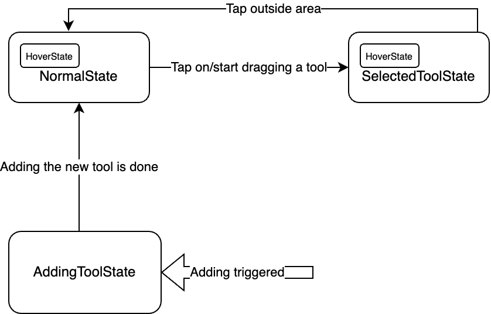

# Interactive Layer

The Interactive Layer is a crucial component of the Deriv Chart that handles user interactions with drawing tools. It manages the lifecycle of drawing tools, from creation to manipulation, and provides a state-based architecture to handle different interaction modes.

## Overview

The Interactive Layer sits on top of the chart canvas and captures user gestures such as taps, drags, and hovers. It then interprets these gestures based on the current state and translates them into actions on drawing tools.

The layer works with two key concepts:
1. **InteractiveState**: Defines the current mode of interaction with the chart
2. **DrawingToolState**: Represents the state of individual drawing tools

## Interactive States

The Interactive Layer implements a state pattern to manage different interaction modes. Each state handles user interactions differently:

### InteractiveNormalState

This is the default state when no drawing tools are selected or being added. In this state:
- The user can tap on existing drawing tools to select them
- The user can initiate adding a new drawing tool
- All drawing tools are in the `DrawingToolState.normal` state
- Includes hover functionality through the `InteractiveHoverState` mixin

### InteractiveSelectedToolState

This state is active when a drawing tool is selected. In this state:
- The selected tool is in the `DrawingToolState.selected` state
- The user can drag the selected tool to move it
- The user can modify specific points of the selected tool
- Tapping outside the selected tool returns to the `InteractiveNormalState`
- Includes hover functionality through the `InteractiveHoverState` mixin

### InteractiveAddingToolState

This state is active when a new drawing tool is being added to the chart. In this state:
- The new tool is in the `DrawingToolState.adding` state
- The user can tap on the chart to define points for the new tool (e.g., start and end points for a line)
- Once the tool creation is complete, the state transitions back to `InteractiveNormalState`

### InteractiveHoverState

This is implemented as a mixin rather than a standalone state, allowing it to be combined with other states:
- Provides hover detection functionality to any state that includes it
- Changes a drawing tool's state to `DrawingToolState.hovered` when the pointer hovers over it
- Reverts the tool's state when the pointer moves away
- Currently used by both `InteractiveNormalState` and `InteractiveSelectedToolState`

This mixin-based approach allows hover functionality to be reused across different states without code duplication, following the composition over inheritance principle.

## State Transitions

The Interactive Layer manages transitions between states based on user interactions:



The diagram above illustrates the state transitions in the Interactive Layer:

1. **NormalState → SelectedToolState**: Occurs when the user taps on or starts dragging an existing drawing tool
2. **SelectedToolState → NormalState**: Occurs when the user taps outside the selected tool
3. **NormalState → AddingToolState**: Occurs when the user initiates adding a new drawing tool
4. **AddingToolState → NormalState**: Occurs when the new tool creation is complete

Note that both NormalState and SelectedToolState include the HoverState functionality through the mixin pattern, as shown in the nested boxes in the diagram.

## DrawingToolState

Each drawing tool on the chart has its own state, represented by the `DrawingToolState` enum:

```dart
enum DrawingToolState {
  /// Default state when the drawing tool is displayed on the chart
  /// but not being interacted with.
  normal,

  /// The drawing tool is currently selected by the user. Selected tools
  /// typically show additional visual cues like handles or a glowy effect
  /// to indicate they can be manipulated.
  selected,

  /// The user's pointer is hovering over the drawing tool but hasn't
  /// selected it yet. This state can be used to provide visual feedback
  /// before selection.
  hovered,

  /// The drawing tool is in the process of being created/added to the chart.
  /// In this state, the tool captures user inputs (like taps) to define
  /// its shape and position.
  adding,

  /// The drawing tool is being actively moved or resized by the user.
  /// This state is active during drag operations when the user is
  /// modifying the tool's position.
  dragging,
}
```

The state of a drawing tool affects how it's rendered on the chart and how it responds to user interactions.

## InteractableDrawing

The `InteractableDrawing` class is the base class for all drawing tools that can be interacted with on the chart. It:

1. Maintains the current state of the drawing tool
2. Provides methods for hit testing (determining if a user tap/drag intersects with the tool)
3. Handles drag operations to move or modify the tool
4. Defines how the tool is painted on the canvas based on its current state

Each specific drawing tool (like `LineInteractableDrawing`) extends this class to implement its own behavior for:
- Hit testing specific to its shape
- Handling drag operations in a way that makes sense for its geometry
- Painting itself with appropriate visual styles based on its state

## Implementation Details

The Interactive Layer uses a combination of gesture detectors and custom painters to:

1. Capture user interactions (taps, drags, hovers)
2. Determine which drawing tools are affected by these interactions
3. Update the state of the Interactive Layer and individual drawing tools
4. Render the drawing tools with appropriate visual styles

When a user interacts with the chart, the Interactive Layer:
1. Determines the current state
2. Delegates the handling of the interaction to the current state object
3. The state object updates the affected drawing tools
4. The drawing tools are repainted with their new states and positions

This architecture provides a clean separation of concerns and makes it easy to add new interaction modes or drawing tool types.