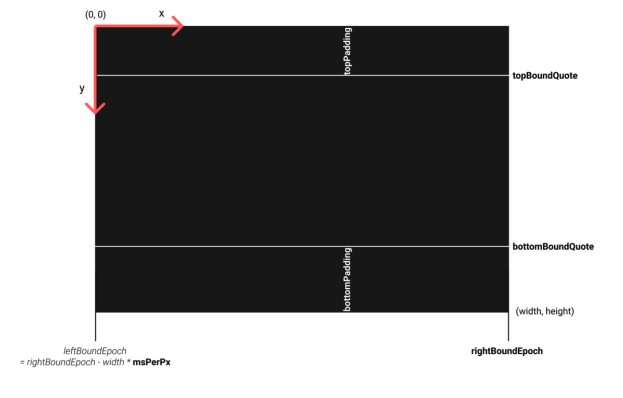
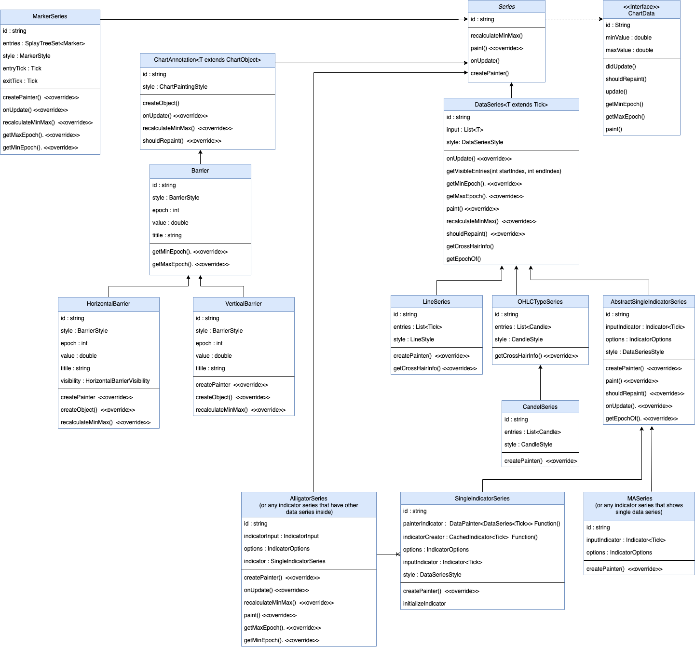
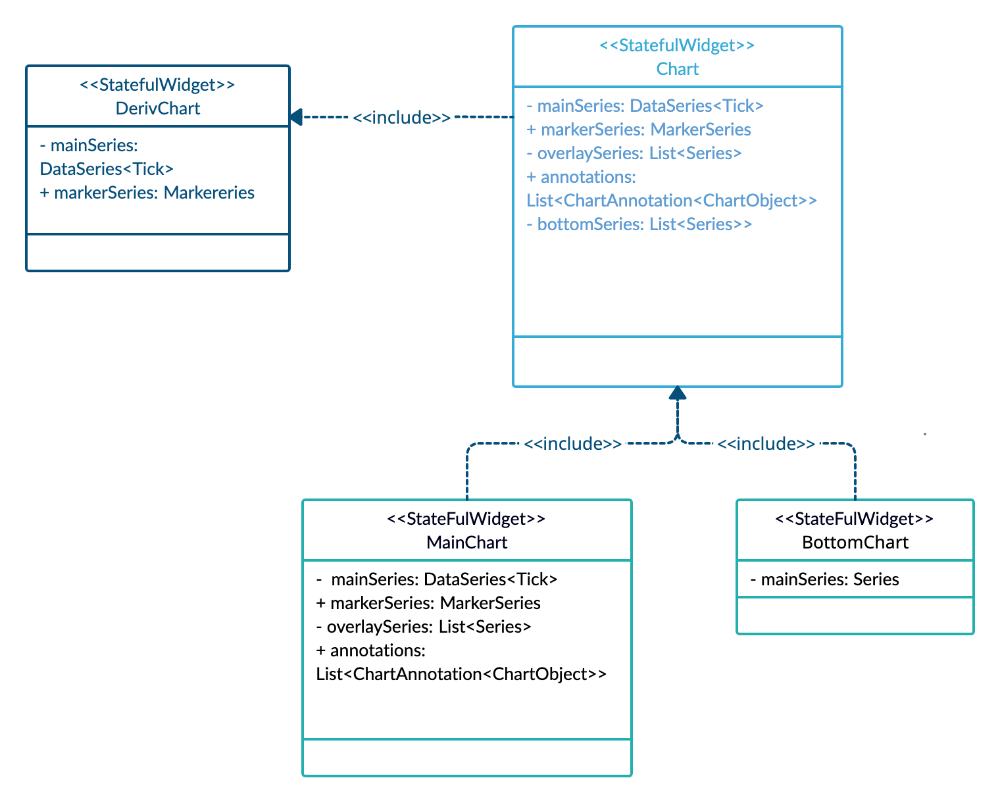

# Market data
The market data(input data of chart) is a list of *Ticks* or *OHLC*.
- A **Tick** data element has two properties, epoch (time-stamp) and quote (price).
- An **OHLC** (candle) data which shows the price changes in a period of time, each candle element has five properties, epoch (time-stamp) and open, close, high, low price values.
These four values respectively represent starting, ending, highest and lowest price in that timeframe.

# Chart Scheme
Chart widget is a Canvas that we paint all data of chart inside this Canvas.

this widget has  X-Axis and Y-Axis enabled by default.

# X-Axis
X-Axis coordination system works with *rightBoundEpoch* and *msPerPx* variables.
1. **rightBoundEpoch**: The time-stamp of the chart screen right edge.
   We initially set it to point to `maxRightBoundEpoch`, The last Tick/OHLC epoch on closed markets, or the last element of the series (overlay/bottom) that has the most positive offset plus a constant offset in pixel (maxCurrentTickOffset).

2. **msPerPx**: which specifies each pixel of the chart screen horizontally consists of how many milliseconds.

3. **leftBoundEpoch**: The time-stamp of the chart screen left edge.
By knowing **msPerPx**(chart's width in pixels) and **rightBoundEpoch**, We can then calculate the **leftBoundEpoch** like this:
**leftBoundEpoch = rightBoundEpoch - screenWidth * msPerPx**
 Also, we can find out which data is inside this range and is going to be visible.

# Y-Axis
For Y-Axis coordination we would need to have min and max quote values that are in the visible area of chart.
1. **topBoundEpoch**: The maximum quote(price) of the data between *rightBoundEpoch* and *leftBoundEpoch*.

2. **bottomBoundEpoch**: The minimum quote(price) of the data between *rightBoundEpoch* and *leftBoundEpoch*.

 **now we can have the two conversion functions which can give us (x, y) positions inside the chart canvas for any epoch and quote values.**

# X-Axis labels
- **gridTimestamps** calculates the  X-Axis labels. it Creates a list of [DateTime] between rightBoundEpoch and leftBoundEpoch with gaps of [timeGridInterval].
- **timeGridInterval** is calculating by function with same name. it Returns the first time interval which has the enough distance between lines.

# Y-Axis labels
**YAxisModel** is a Model for calculating the grid intervals and quotes(labels).
by knowing the **topBoundQuote** and **bottomBoundQuote** we calculate the labels based on interval. this intervals calculates by **quoteGridInterval**.
- **quoteGridInterval** Calculates the grid interval of a quote by getting the [quotePerPx] value.
- **quotePerPx** Calculates the quotes that can be placed per pixel by division of distance between topBound and bottomBound in quote and pixel.

`minDistanceBetweenLines` determines the minimum distance that we want two consecutive Y-Axis labels to have.
`intervals` is a static list of doubles that shows Options for quote labels value distance in Y-Axis.
One of these intervals will be selected to be the distance between Y-Axis labels.
the number from `intervals` list is selected as an interval that using it with the given [quotePerPx] will give us distance more than `minDistanceBetweenLines`.

# X-Axis scrolling
Scrolling in the chart happens by updating **rightBoundEpoch** of the chart's X-Axis.
changing the **rightBoundEpoch** amount will change the chart’s scroll position. **rightBoundEpoch** be on the last tick when we first load the chart.

# Zooming
Zooming in the chart happens by updating **msPerPx**.
**msPerPx** is for changing the zoom level of the chart, increasing it will result in zoom-out and decreasing to zoom-in.

# *Painting data*

## Data Visualisation

We have an abstract class named **ChartData** that represents any type of data that the chart takes and makes it paint its self on the chart's canvas including *Line*, *Candle* data, *Markers*, *barriers*, etc.
A **ChartData** can be anything that shows some data on the chart. The chart can take a bunch of ChartData objects and paint them on its canvas.

**DataSeries** is a Super class of any data series that has ***one*** list of sorted data to paint (by epoch).
  **LineSeries**, **CandleSeries**, **OHLCSeries**,AbstractSingleIndicatorSeries(all indicator series that shows only one sequential data like **MASeries**(for moving average), **RSISeries**) are all subclasses of DataSeries directly or not.
**DataSeries** holds the common functionalities of managing this list of sorted data.

**Series** is the Base class of all chart series paintings.
The series that have ***more than one*** list of sorted data to paint (like AlligatorIndicatorSeries) extend from **Series** and have some SingleIndicatorSeries inside.

### ChartObject
Any component which can take a rectangle area on the chart's canvas.
It has `isOnEpochRange` and `isOnValueRange` method that shows whether this chart object is in chart horizontal or vertical visible area or not.

### BarrierObject
A **ChartObject** for defining position of a horizontal or vertical barrier.

### Chart annotations
Annotations are ChartData without any sequential data that added to the chart, like **Barriers**.
**ChartAnnotation** is a Base class of chart annotations that extends from **Series**.

### Barriers
**Barrier** is a base class of barrier. Its properties are title, epoch and value.
We have two kinds of barriers: **VerticalBarrier** and **HorizontalBarrier**.
**VerticalBarrier**: is a vertical line in the chart that draws on a specific timestamp. It extends from the **Barrier** class.
**HorizontalBarrier**: is a horizontal line that draws on a specific value(price).

**TickIndicator** is a subclass of **HorizontalBarrier** to show the current tick label and horizontal line. It has its own default configuration like the **HorizontalBarrierVisibility** type.
The reason that we have **TickIndicator** is to recognize the difference between **HorizontalBarrier** and **TickIndicator** if the user did not define the id for them.

To add horizontal/vertical barriers, specify them in the `annotations` parameter of the chart.
They have the `createPainter` object to paint the **BarrierObject** that gets initiated in their `createObject` method.

### Markers
**MarkerSeries** extends from **Series** to show the markers that are added to the chart.

# Painter classes

**SeriesPainter** is an abstract class responsible for painting its [series] data.

We have an abstract class named **DataPainter** that extends from **SeriesPainter**  and it is a class for painting common options of [DataSeries] data.

Other painters like **LinePainter**( A [DataPainter] for painting line data), **CandlePainter**(A [DataPainter] for painting CandleStick data) and **ScatterPainter**, all extend from **DataPainter**.

**DataPainter** has a method called `onPaint` that calls `onPaintData`. It actually paints what's inside `onPaintData` that is overridden by each painter. for example **LinePainter** paints line in `onPaintData` method and **CandlePainter** paints Candles and `onPaintData` method. `onPaint` is a method where **DataPainters**  need to do some common things before painting.

For painting Barriers, we have **VerticalBarrierPainter** and **HorizontalBarrierPainter** that also extend from **SeriesPainter**.
They override the `onPaint` method to draw a Vertical/Horizontal Barrier.

We have a `StatefulWidget` named **MarkerArea** to draw markers inside it.
**MarkerArea** is a Layer with markers.
For painting markers we have the **MarkerPainter** class extends from `CustomPainter`.

***The data in Visible area are between **rightBoundEpoch**, **leftBoundEpoch** and **topBoundEpoch**, **bottomBoundEpoch**, will be painted by these painters.***

# Painting chart data
when the list of data changes(by scrolling, zooming, or receiving new data) we need to update the chart.
There are 3 steps that the chart requires to do when these variables change in order to update its components(including mainSeries, indicators, Barrier, markers, ... ).

1. The chart goes through its components and notifies them about the change. Each of these components then updates their visible data inside the new (leftEpoch, rightEpoch) range.
 Then they can determine what are their min/max value (quote/price).

2. The chart then asks every component their min/max values through their `minValue` and `maxValue` getters to calculate the overall min/max of its Y-Axis range.
 Any component that is not willing to be included in defining the Y-Axis range can return `double.NaN` values as its min/max.
 Then if this component had any element outside of the chart's Y-Axis range that element will be invisible.

3. The conversion functions always return the converted x, y values based on the updated variables (Left/right bound epoch, min/max quote, top/bottom padding).
 The chart will pass these conversion functions along with a reference to its canvas and some other variables to ChartData class to paint their visible data.

# Cross-hair
We have a `StatefulWidget` **CrosshairArea** that places this area on top of the chart to display candle/point details on longpress.
It contains three other StatelessWidgets named **CrosshairDetails** (The details to show on a crosshair) and **CrosshairLinePainter** (A custom painter to paint the crosshair `line`) and **CrosshairDotPainter** (A custom painter to paint the crosshair `dot`).

When `onLongPressStart` starts, `onCrosshairAppeared` is called to show candle/point details then we stop auto-panning to make it easier to select candle or tick and show the longpress point details on the chart.
Also, we start a timer to track the user scrolling speed.
In the `updatePanSpeed` method, we update the pan speed and scroll when the crosshair point closes to the edges. In normal cases, when the crosshair point is not close to edges, in `onLongPressStart` we make the pan speed equal to 0 to avoid scrolling, but when the user is getting close to edges we need to scroll the chart, so `updatePanSpeed` will help us.
In `onLongPressUpdate` we call `updatePanSpeed`, then we calculate how much time is passed between `onLongPressStart` and `onLongPressUpdate`, and then calculate the animation speed based on this time(using VelocityTracker), then we animate with that speed between the two different points that the user scrolled to show the crosshair.
In `onLongPressEnd`, `onCrosshairDisappeare` is called when the candle or the pointer is dismissed and auto-panning starts again and [crosshairTick] will clear.

# Theme
Chart has its own default dark and light themes that switch depending on Theme.of(context).brightness value. If the user creates their own themes, they would have to handle switching it themselves.
`chart_theme` is the interface, `chart_default_theme` is a default implementation of the `chart_theme` which is instantiated and used inside the `Chart` widget if no theme is passed from the app to the `Chart` widget.

`painting_styles` are some style classes that are used to specify how certain components of the chart should be styled. e.g. `barrier_style` contains style parameters of barriers.

# BasicChart
**BasicChart** is a simple chart widget that takes only one `Series` class to paint. It handles common functionalities of handling Y-axis range, scaling and its animation, top/bottom padding.

# MainChart
**MainChart** is a subclass of **BasicChart** and a customized widget that can show multiple `ChartData` (like `overlaySeries and `markerSeries`) and adds crosshair feature and some other minor features.

# BottomChart
Sometimes we need to show two charts on the screen, for example for showing bottom indicators. In that case, we use **BottomChart** that extends from **BasicChart** to show the other chart widgets.

# Chart
**Chart** is a widget that manages showing  **MainChart** and multiple **BottomChart**s (to have `bottomSeries`, series that have different Y-scale than the MainChart) vertically.
**MainChart** and **BottomChart**s use the same **XAxis** (and it's provided in the root of the `Chart` widget to be accessible on the widgets at the bottom) but they have different YAxis.

# DerivChart
**DerivChart** A wrapper around the **chart** widget which provides the UI to add/remove indicators and to manage saving/restoring selected ones on storage.

*if you want to have indicators in the chart, you should use ***DerivChart** instead of **Chart****

# Widgets
## Market Selector Widget
The widget that we have included it in the chart project to be accessable inside any other project which is going to use the chart, because this widget is supposed to show the asset (symbols) list to be shown by the chart.

## AnimatedPopupDialog
AnimatedPopupDialog is just a wrapper widget to wrap around any widget to show as a dialog. The dialog will pop up with animation.

## CustomDraggableSheet
CustomDraggableSheet is a wrapper widget to be used combined with a bottom sheet that makes to give the widget inside the bottom sheet the behavior that we want.

